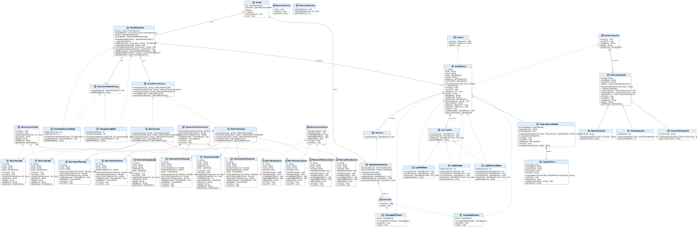

# Smart Home Devices System -> Made by Hazem Ahmed

A C++17 simulation of a smart home ecosystem built entirely around **software design patterns**. Every major feature in the system is powered by a pattern — not just to follow theory, but because each pattern solves a real architectural problem in the domain.

---

## UML Class Diagram



---

## Why Design Patterns?

Smart home systems are inherently complex: they must support **multiple device tiers**, **dynamic behavior**, **event-driven automation**, and **extensibility** without breaking existing code. Design patterns provide proven, structured solutions to exactly these challenges.

---

## Patterns Used

### 1. 🏭 Abstract Factory
> *Create families of related devices without specifying concrete classes.*

The system supports two product lines — **Basic** and **Premium**. The `SmartDeviceFactory` interface lets the hub create lights, thermostats, cameras, door locks, and motion sensors without knowing which tier it's working with. Swapping factories switches the entire product line in one change.

```
SmartDeviceFactory  ◄── BasicFactory
                    ◄── PremiumFactory
```

---

### 2. 🌲 Composite
> *Treat individual devices and groups of devices uniformly.*

Devices are organized into a tree: `FloorComposite` → `RoomComposite` → `SmartDevice`. Calling `turnOn()` on a floor turns on every device in every room on that floor. No special-casing needed — the composite and leaf share the same `SmartComponent` interface.

```
FloorComposite
  └── RoomComposite
        └── SmartDevice  (leaf)
```

---

### 3. 👁️ Observer
> *Automatically react to device state changes.*

`SmartDevice` (subject) notifies all attached `Observer` instances whenever its state changes. `AutomationController` implements `Observer` and logs every event. Adding new reactions (logging, alerts, analytics) requires zero changes to device code.

```
SmartDevice ──notify()──► AutomationController::update()
```

---

### 4. ⚡ Command
> *Encapsulate actions as objects to support undo.*

`TurnLightONComm` and `TurnLightOFFComm` wrap device actions. The `AutomationController` keeps a command history, enabling full undo support. This decouples the invoker from the receiver and makes automation sequences composable.

```
execute()  →  device->turnOn()
undo()     →  device->turnOff()
```

---

### 5. 🔄 State
> *Let a device's behavior change based on its current state.*

A `SmartDevice` delegates `turnOn()`, `turnOff()`, and `dim()` to its current `DeviceState` object. Transitioning between states changes behavior automatically — no `if/else` chains anywhere in the codebase.

```
LightOffState  ──turnOn()──►  LightOnState  ──dim()──►  LightDimmedState
```

---

### 6. 🎯 Strategy
> *Switch automation behavior at runtime without changing the hub.*

`ComfortAutomationMode` and `EnergySavingMode` both implement `AutomationModeStrategy`. The hub calls `applyMode()` on whatever strategy is active. Switching mode is a one-liner — the hub is completely decoupled from policy details.

```
SmartHomeHub::setMode(new EnergySavingMode())
```

---

### 7. 🔌 Adapter
> *Integrate legacy devices without modifying their source.*

`LegacyDevice` exposes a raw string-based API incompatible with the modern `SmartDevice` interface. `LegacyDeviceAdapter` wraps it and translates calls, making old hardware plug straight into the new system with no changes to either side.

```
SmartDevice interface  ◄──  LegacyDeviceAdapter  ──wraps──►  LegacyDevice
```

---

## Project Structure

```
Headers/          # All interface and class declarations
  Adapter/        # Adapter pattern
  Command/        # Command pattern
  Composite/      # Composite pattern
  Factory/        # Abstract Factory pattern
  Hub/            # SmartHomeHub
  Observer/       # Observer pattern
  State/          # State pattern
  Strategy/       # Strategy pattern

Implementation/   # All .cpp definitions mirroring Headers/
  main.cpp        # Entry point
  Client/         # Client class — orchestrates all patterns
```

---

## Build & Run

> Requires **MSYS2 / MinGW-w64** on Windows.

```bash
mingw32-make        # Build
mingw32-make run    # Build & run
mingw32-make clean  # Remove build artifacts
```

---

## Pattern Interaction Map

```
Client
 ├── SmartHomeHub  (uses AbstractFactory to create devices)
 │    ├── FloorComposite → RoomComposite → SmartDevice  [Composite]
 │    └── setMode(Strategy)                             [Strategy]
 ├── SmartDevice
 │    ├── notifies → AutomationController               [Observer]
 │    └── delegates → DeviceState                       [State]
 ├── AutomationController
 │    └── executes / undoes → Command                   [Command]
 └── LegacyDeviceAdapter → LegacyDevice                 [Adapter]
```